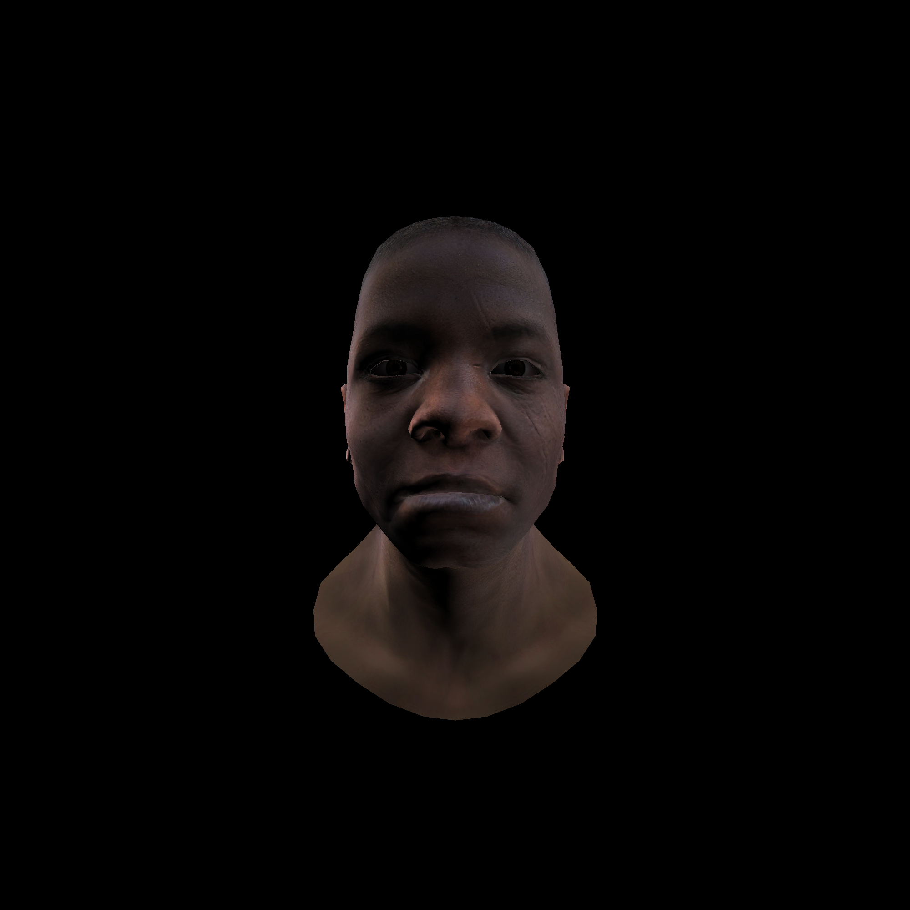
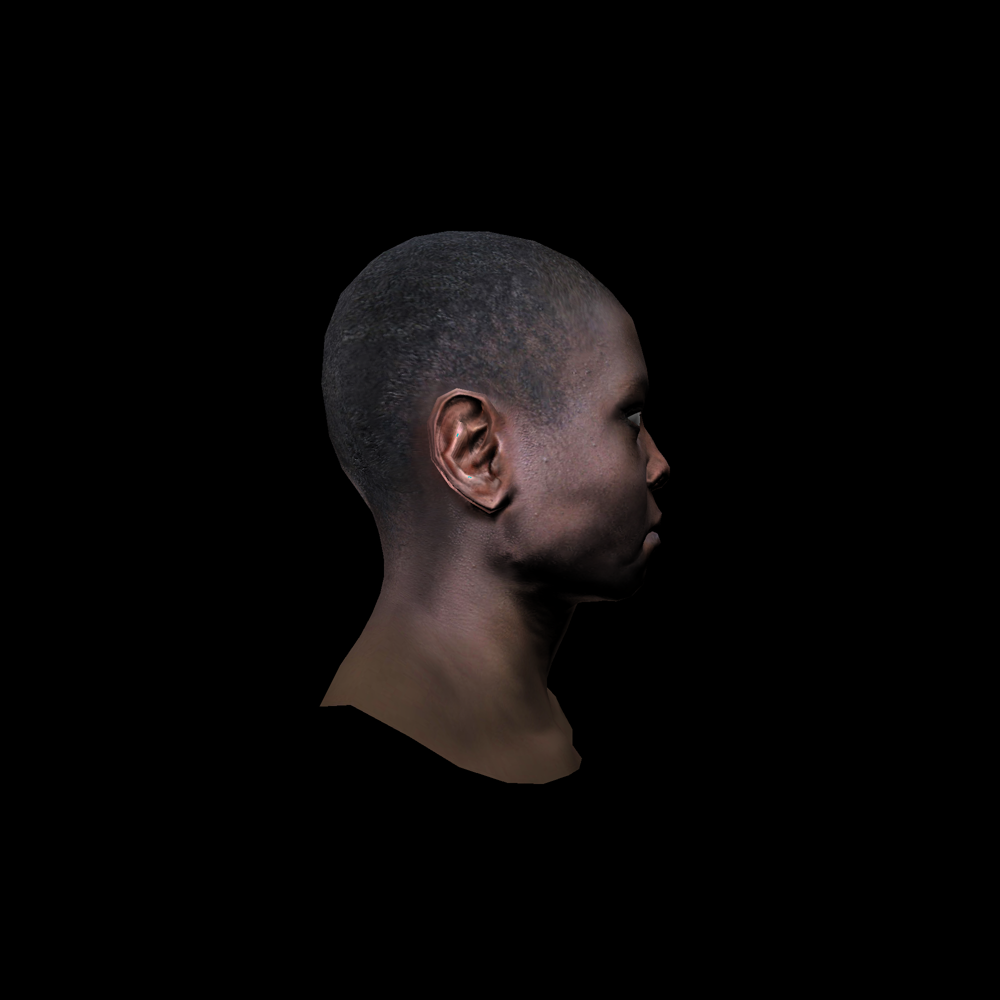

# renderer

Projet pour le cours Foncionnement d'un moteur de rendu 3D de [@ssloy](https://github.com/ssloy), dont le but est de comprendre le fonctionnement d'un moteur de rendu 3D 🙃 qui utilise la rasterisation.

Fonctionnalités implémentées :
- Flat shading puis Gouraud shading ✅
- Z-buffer ✅
- Backface culling ✅
- Perspective correct texturing ❌
> J'avais commencé mais je n'ai pas continuer car le problème n'apparessait pas dans le rendu fina sauf que maintenant oui avec le sol.
- Normal mapping ✅
- Specular mapping ✅
- Shadow mapping ❌

> Le shadow mapping n'a pas été implémenté dans ce projet car le code est brouillon et devient difficile à maintenir. Mais j'ai bien compris le principe et je pourrais l'implémenter dans mes futurs projets OpenGL.

J'ai utiliser GLM, car j'y suis habitué mais j'ai d'abord implémenté les calculs moi-même pour bien comprendre le fonctionnement.

## Lancer le projet

### Prérequis

- [CMake](https://cmake.org/)
- [gcc](https://gcc.gnu.org/)
- [git](https://git-scm.com/)

> [!IMPORTANT]
> Ce projet utilise la librairie [glm](https://github.com/g-truc/glm) en tant que sous-module git. Faites attention à bien cloner le projet avec les sous-modules.

### Compilation

```bash
mkdir build
cd build
cmake ..
make
```

### Utilisation

> [!TIP]
> Retournez à la racine du projet pour lancer le programme afin qu'il puisse trouver les fichiers de ressources.

```bash
cd ..
./build/renderer
```

> [!NOTE]
> une image `output.tga` est générée dans le dossier depuis lequel vous avez lancé le programme.

## Résultats




> [!NOTE]
> Des bloopers sont disponibles dans le dossier `bloopers`. Malheureusement, je n'ai pas tout enregistré, mais j'ai produit un effet intéressant sans le faire exprès que je réutiliserai dans un shader.

## Auteur
|  |
| :---: |
| [Antonin ROUSSEAU](https://github.com/toxicbloud) |
